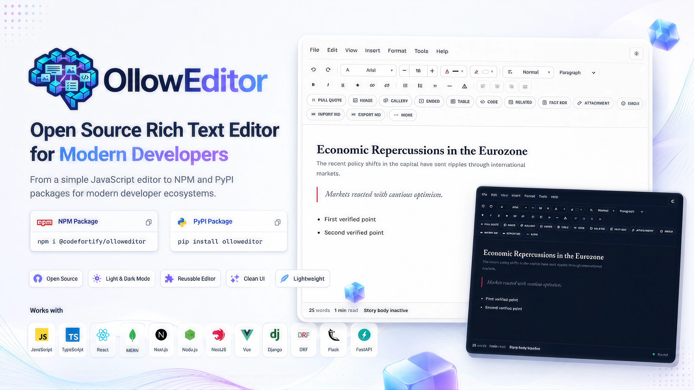

# OllowEditor

A modern, open-source rich-text editor for JavaScript and Python ecosystems.

OllowEditor provides one editing experience through a framework-independent
browser implementation, a published npm package with a React adapter, and a
Python package with Django, Django REST Framework, Flask, and FastAPI
integrations. The project is maintained by CodeFortify.

<p align="center">
  
</p>

## Features

- Rich text, headings, lists, links, tables, code blocks, quotes, and embeds
- Image, gallery, and attachment workflows with configurable server uploads
- HTML source mode, Markdown import/export, and document import/export tools
- Responsive desktop, tablet, and mobile toolbars
- Light, dark, and automatic themes
- Textarea synchronization for standard forms and APIs
- JavaScript plugin and keyboard-shortcut APIs
- TypeScript declarations and a React component
- Packaged static assets and upload integrations for Python web frameworks
- Safe plain-text and media previews for Django admin list views

## Ecosystems

| Ecosystem | Location | Distribution |
| --- | --- | --- |
| Vanilla JavaScript | [`packages/javascript/`](packages/javascript/) | Direct integration |
| JavaScript and React | [`packages/npm/`](packages/npm/) | [`@codefortify/olloweditor`](https://www.npmjs.com/package/@codefortify/olloweditor) |
| Python web frameworks | [`packages/python/`](packages/python/) | [`olloweditor`](https://pypi.org/project/olloweditor/) |

The npm package contains the framework-independent core and a React adapter.
Its examples also cover TypeScript, Next.js, Vue, Express upload handling, and
NestJS upload handling. The Python distribution contains implemented Django,
DRF, Flask, and FastAPI integrations.

## Installation

### Vanilla JavaScript

Use the files in `packages/javascript/` directly:

```html
<link rel="stylesheet" href="path/to/ollow.css">
<script src="path/to/ollow.js"></script>
<textarea id="editor" name="content"></textarea>
<script>
  OllowEditor.init("#editor");
</script>
```

See the [Vanilla JavaScript guide](packages/javascript/README.md).

### npm

```bash
npm install @codefortify/olloweditor
```

```js
import { createOllowEditor } from "@codefortify/olloweditor";
import "@codefortify/olloweditor/style.css";

createOllowEditor("#editor");
```

React and framework examples are in the [npm package guide](packages/npm/README.md).

### PyPI

```bash
pip install olloweditor
pip install "olloweditor[django]"  # choose only the integration you need
```

Available extras are `django`, `drf`, `flask`, `fastapi`, and `all`. See the
[Python package guide](packages/python/README.md) for setup, uploads, static
assets, and safe preview behavior.

## Repository Structure

```text
.
├── .github/             # contribution templates and automation
├── docs/                # cross-project architecture and development docs
├── packages/
│   ├── javascript/      # dependency-free browser implementation
│   ├── npm/             # npm core, React adapter, and JS examples
│   └── python/          # PyPI distribution and Python integrations
└── website/             # project website and combined documentation
```

Examples stay with the implementation that owns and tests them. This avoids
duplicating package-specific setup under a second root examples tree. See
[`docs/repository-structure.md`](docs/repository-structure.md) for details.

## Development

Clone the repository and run checks from the relevant implementation:

```bash
git clone https://github.com/CodeFortifyCloud/olloweditor.git
cd olloweditor

npm run check:javascript
npm run check:npm
npm run check:python-frontend
```

Python checks require a virtual environment and development extras:

```bash
python -m venv .venv
. .venv/bin/activate
python -m pip install -e "./packages/python[all,test,dev]"
python -m pytest packages/python/tests
python -m ruff check packages/python
python -m mypy packages/python/src
```

Detailed setup is in [`docs/development.md`](docs/development.md). Architecture
and release boundaries are documented in [`docs/architecture.md`](docs/architecture.md)
and [`docs/release-process.md`](docs/release-process.md).

## Contributing and Support

Read [`CONTRIBUTING.md`](CONTRIBUTING.md) before opening a pull request. Use
GitHub Issues for reproducible bugs and follow [`SUPPORT.md`](SUPPORT.md) for
questions. Potential vulnerabilities must be reported privately according to
[`SECURITY.md`](SECURITY.md), not posted in a public issue.

## License

OllowEditor is available under the [MIT License](LICENSE). Package-specific
copies are retained with the published npm and Python distributions.

Copyright (c) 2026 CodeFortify.
