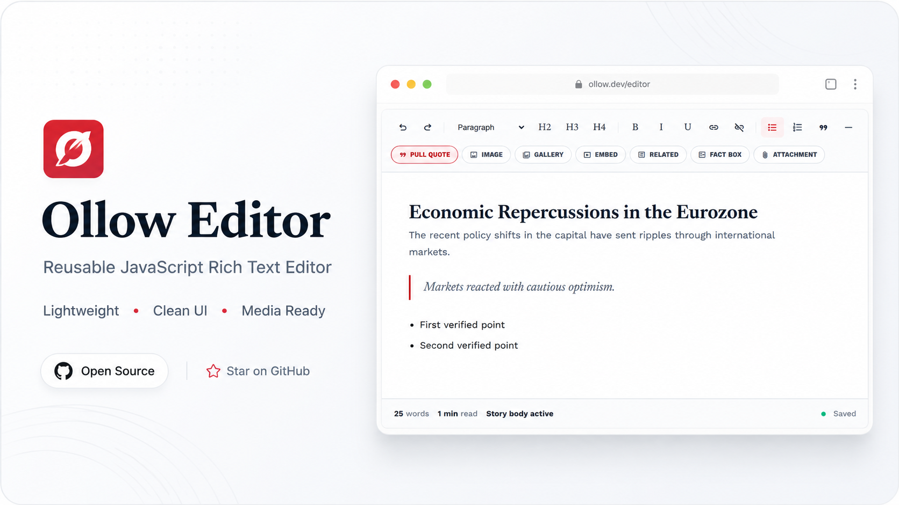

# Ollow Editor

A clean, reusable, lightweight JavaScript rich-text editor built with plain HTML, CSS, and JavaScript.

Ollow Editor is designed for newsroom-style writing, blog publishing, CMS forms, article editors, and admin dashboards. It works with a normal `<textarea>` and syncs the final HTML automatically, so it can be used easily in any backend application such as Django, Laravel, Rails, Express, or plain HTML forms.

---

## Preview



---

## Features

- Clean newsroom-style writing interface
- Reusable JavaScript editor
- Works with a normal `<textarea>`
- No external dependencies
- Toolbar formatting
- Paragraph and heading support
- Bold, italic, underline
- Link and unlink support
- Bookmark / anchor support
- Special character picker
- Bullet and numbered lists
- Pull quote block
- Image upload from local machine
- Drag-and-drop image upload
- Media alignment controls
- Light / dark / auto themes
- Markdown import/export
- Plugin API
- Code block support
- Table support
- Image URL insertion
- Multiple-image gallery block
- YouTube embed rendering
- Related content block
- Fact box block
- Attachment block
- Word count
- Estimated read time
- Autosave-style status indicator
- Synced HTML output for form submission

---

## Project Structure

```txt
olloweditor/
├── ollow.html
├── ollow.css
├── ollow.js
└── README.md
```

---

## Quick Start

Open the demo file directly in your browser:

```bash
cd /home/jaki/Dev/olloweditor
xdg-open ollow.html
```

Or serve it with a local server:

```bash
python3 -m http.server 8000
```

Then visit:

```txt
http://localhost:8000/ollow.html
```

---

## Basic Usage

Add a textarea in your form:

```html
<textarea id="ollo-editor" name="content" data-theme="dark" data-persist-theme="true"></textarea>
```

Include the editor CSS and JavaScript:

```html
<link rel="stylesheet" href="ollow.css" />

<script src="ollow.js"></script>
```

Initialize the editor:

```html
<script>
  document.addEventListener("DOMContentLoaded", function () {
    OllowEditor.init("#ollo-editor", {
      theme: "dark",
      persistTheme: true
    });
  });
</script>
```

After editing, the textarea will contain the synced HTML output.

The global API is available as both `OllowEditor` and `NationWireEditor`.

Plugins can be registered globally before initialization with `OllowEditor.registerPlugin(...)`.

Theme can be configured per editor with `light`, `dark`, or `auto`.

You can also configure image uploads during initialization:

```html
<script>
  document.addEventListener("DOMContentLoaded", function () {
    OllowEditor.init("#ollo-editor", {
      upload: {
        imageUrl: "/upload/image",
        galleryUrl: "/upload/gallery",
        attachmentUrl: "/upload/attachment",
        allowFallback: false
      }
    });
  });
</script>
```

---

## Example Form

```html
<form method="post">
  <textarea id="ollo-editor" name="body">
    <h2>Article title</h2>
    <p>Start writing your story...</p>
  </textarea>

  <button type="submit">Save Article</button>
</form>

<link rel="stylesheet" href="ollow.css" />
<script src="ollow.js"></script>

<script>
  document.addEventListener("DOMContentLoaded", function () {
    OllowEditor.init("#ollo-editor");
  });
</script>
```

---

## Toolbar Options

Ollow Editor currently supports:

| Feature       | Description                     |
| ------------- | ------------------------------- |
| Undo / Redo   | Revert or restore changes       |
| Font Family   | Apply approved font families    |
| Font Size     | Apply approved font sizes       |
| Paragraph     | Set normal paragraph text       |
| H2 / H3 / H4  | Insert heading styles           |
| Bold          | Make selected text bold         |
| Italic        | Make selected text italic       |
| Underline     | Underline selected text         |
| Link          | Insert a hyperlink              |
| Unlink        | Remove hyperlink                |
| Bookmark      | Insert an internal anchor       |
| Ω Symbols     | Insert special characters       |
| Bullet List   | Insert unordered list           |
| Numbered List | Insert ordered list             |
| Pull Quote    | Insert styled quote block       |
| Image         | Insert uploaded or URL image    |
| Import MD     | Paste Markdown into the editor  |
| Export MD     | Convert editor HTML to Markdown |
| Code          | Insert editable code block      |
| Gallery       | Insert multiple uploaded images |
| Embed         | Insert YouTube video            |
| Related       | Insert related-content block    |
| Fact Box      | Insert highlighted fact block   |
| Attachment    | Insert attachment-style block   |

---

## Keyboard Shortcuts

Shortcuts run only while the editor body is focused. They do not fire inside modal inputs, textareas, selects, file pickers, or other page form fields.

Default shortcuts:

- `Ctrl/Cmd + B` bold
- `Ctrl/Cmd + I` italic
- `Ctrl/Cmd + U` underline
- `Ctrl/Cmd + K` insert or edit link
- `Ctrl/Cmd + Z` undo
- `Ctrl/Cmd + Shift + Z` redo
- `Ctrl/Cmd + Y` redo
- `Ctrl/Cmd + Alt + 2` H2
- `Ctrl/Cmd + Alt + 3` H3
- `Ctrl/Cmd + Alt + 4` H4
- `Ctrl/Cmd + Alt + 0` paragraph
- `Ctrl/Cmd + Shift + 7` numbered list
- `Ctrl/Cmd + Shift + 8` bullet list
- `Ctrl/Cmd + Shift + Q` blockquote
- `Ctrl/Cmd + Shift + H` horizontal rule
- `Ctrl/Cmd + Shift + C` code block
- `Ctrl/Cmd + S` sync editor HTML and prevent the browser save dialog
- `Esc` close the open modal or editor floating toolbar

Custom shortcut API:

```js
const editor = OllowEditor.get("#ollo-editor");

editor.addShortcut("mod+shift+m", () => {
  editor.insertHTML("<p>Note</p>");
});

editor.removeShortcut("mod+shift+m");
const shortcuts = editor.getShortcuts();
```

## Bookmarks and Anchors

Use the `Bookmark` toolbar button near the link tools to insert internal anchors for long articles.

The editor also exposes a clearly visible `Bookmark` pill in the insert toolbar row so the anchor tool is easy to find.

Bookmark rules:

- the name generates a lowercase slug automatically
- IDs use hyphens
- unsafe characters are removed
- duplicate IDs are auto-suffixed, such as `economic-policy-section-2`

Inserted bookmark HTML:

```html
<span class="ollow-bookmark" id="economic-policy-section" data-bookmark="true" contenteditable="false">
  🔖 Economic Policy Section
</span>
```

Clicking a bookmark marker shows a floating toolbar with:

- edit
- copy link
- delete

The link modal also lists existing bookmarks and can create internal links like:

```html
<a href="#economic-policy-section">Jump to Economic Policy Section</a>
```

Sanitizer notes:

- keeps `.ollow-bookmark`
- keeps safe bookmark `id` values
- keeps `data-bookmark="true"`
- keeps `href="#bookmark-id"` links
- strips unsafe IDs, event handlers, and `javascript:` links

## Special Characters

Use the `Ω Symbols` toolbar button to open the special character picker.

The picker includes:

- search
- category tabs
- recent characters
- preview

Included categories:

- punctuation
- currency
- math
- arrows
- legal / editorial
- fractions
- newsroom symbols

Recent characters are kept in memory and also stored in `localStorage` under `ollow-recent-special-chars`.

Insertion behavior:

- restores the saved editor selection
- inserts the chosen character at the cursor
- replaces the current text selection if one exists
- keeps the textarea storing normal HTML content, with the character inserted as plain text

## Font Family and Size

The main toolbar includes Microsoft Office-style typography controls near the beginning of the row:

- font family dropdown
- font size field
- decrease font size button
- increase font size button
- text color picker
- highlight color picker

Font size behavior:

- selecting a preset applies that size to the current selection
- with a collapsed selection, the size is applied to the current block
- the `−` and `+` buttons move through the preset size list
- values are clamped between `8` and `96`
- non-preset values are normalized to the nearest preset size

Supported font families:

- Arial
- Times New Roman
- Georgia
- Verdana
- Tahoma
- Trebuchet MS
- Courier New
- Roboto
- Roboto Mono
- Montserrat
- Lora
- Merriweather
- Playfair Display
- EB Garamond
- Oswald
- Nunito
- Spectral

Supported size presets:

- `8`
- `9`
- `10`
- `11`
- `12`
- `14`
- `16`
- `18`
- `20`
- `22`
- `24`
- `28`
- `32`
- `36`
- `48`
- `60`
- `72`
- `96`

Saved HTML uses safe classes:

```html
<p>
  Normal text <span class="ollow-font-georgia">Georgia text</span>
</p>
```

```html
<p>
  Normal text <span class="ollow-font-size-22">22px text</span>
</p>
```

```html
<p>
  <span class="ollow-font-georgia ollow-font-size-22">Styled text</span>
</p>
```

Typography sanitizer notes:

- only approved `ollow-font-*` classes are preserved
- only approved `ollow-font-size-*` classes are preserved
- pasted Word and Google Docs font styling is mapped only when it matches an allowed font or size
- unsafe inline typography styles are removed
- unknown font-family classes are stripped during sanitization
- unknown font-size classes are stripped during sanitization

Font dropdown notes:

- the toolbar control sits before paragraph and heading controls
- the menu has `Recent Fonts` and `All Fonts` sections
- recent fonts update when a font is chosen and are kept for the current page session
- the recent list is also stored in localStorage when available

These controls use the same toolbar variables and dropdown surfaces as the rest of the editor, so they work in light, dark, and auto theme modes.

## Text Color

The text color control sits in the main toolbar immediately after the font size control and before the paragraph / heading controls.

The button shows:

- an `A` glyph
- a live color underline for the current selection
- a dropdown arrow

The palette includes:

- `Automatic` to remove text color formatting
- newsroom theme colors
- standard colors
- recent colors
- a custom hex color input

Preset colors save with approved classes, for example:

```html
<p>
  <span class="ollow-text-color-red">Red text</span>
  <span class="ollow-text-color-blue">Blue text</span>
</p>
```

Custom colors save as a safe inline style only when the value is a valid hex color:

```html
<p>
  <span style="color:#ef4444">Custom red text</span>
</p>
```

Sanitizer notes:

- only approved `ollow-text-color-*` classes are preserved
- inline `color` is preserved only for `#rgb` and `#rrggbb`
- `rgb()`, `rgba()`, `hsl()`, `var()`, `url()`, `expression()`, and unknown color values are stripped
- pasted Word and Google Docs color styling is kept only when it maps to a safe hex color

Test steps:

1. Select text in the editor.
2. Open the `Text color` palette from the toolbar.
3. Apply a preset such as red or blue.
4. Apply a custom hex color.
5. Use `Automatic` and confirm the color formatting is removed.
6. Sync and inspect the saved HTML.

## Highlight Color

The highlight control sits beside the text color control in the main toolbar. It uses a compact Office-style button with:

- a small `ab` label
- a live highlight indicator
- a dropdown arrow

The palette includes:

- `No highlight`
- yellow
- green
- cyan
- pink
- red
- orange
- purple
- gray
- custom hex color

Preset highlights save with approved classes:

```html
<p>
  <span class="ollow-highlight-yellow">Highlighted text</span>
</p>
```

Custom highlights save as safe inline styles only for valid hex values:

```html
<p>
  <span style="background-color:#fef3c7">Custom highlight</span>
</p>
```

Sanitizer notes:

- only approved `ollow-highlight-*` classes are preserved
- inline `background-color` is preserved only for `#rgb` and `#rrggbb`
- background images and arbitrary CSS are removed
- pasted Word and Google Docs highlight styling is kept only when it maps to a safe hex color

## Styles Dropdown

The toolbar includes a `Styles` dropdown before the `Paragraph` control. It is intended for reusable writing patterns that go beyond headings.

Available presets:

- `Normal`
- `Lead paragraph`
- `Caption`
- `Small text`
- `Warning note`
- `Info note`
- `Success note`
- `Editorial note`
- `Inline code`
- `Quote emphasis`

Saved HTML examples:

```html
<p class="ollow-style-lead">Lead copy</p>
<p class="ollow-style-warning">Warning note</p>
<code class="ollow-style-inline-code">const value = 1;</code>
<blockquote class="ollow-style-quote-emphasis">Quoted emphasis</blockquote>
```

Sanitizer notes:

- only approved `ollow-style-*` classes are preserved
- `Normal` removes the preset class without stripping unrelated bold, italic, underline, font, or color formatting

## Strikethrough

The inline formatting group now includes a `Strikethrough` button beside `Bold`, `Italic`, and `Underline`.

Shortcut:

- `Ctrl/Cmd + Shift + X`

Saved output uses semantic strike markup:

```html
<p>Normal <s>struck text</s></p>
```

Sanitizer notes:

- `strike` pasted from external sources is normalized to `<s>`
- unsafe attributes are stripped as part of the normal HTML sanitizer

## Subscript and Superscript

The inline formatting group now includes:

- `Subscript` (`x₂`)
- `Superscript` (`x²`)

Shortcuts:

- `Ctrl/Cmd + ,` for subscript
- `Ctrl/Cmd + .` for superscript

Saved output uses semantic HTML:

```html
H<sub>2</sub>O
x<sup>2</sup>
```

Behavior notes:

- subscript and superscript are mutually exclusive
- applying one clears the other first
- the sanitizer preserves clean `<sub>` and `<sup>` markup and strips unsafe attributes

## Remove Formatting

The inline formatting group now includes a `Remove formatting` button labelled `Tx`.

Shortcut:

- `Ctrl/Cmd + \`

What it removes from selected text or the current text block:

- bold
- italic
- underline
- strikethrough
- subscript
- superscript
- font family classes
- font size classes
- text color
- highlight color
- inline styles
- inline code styling
- block style preset classes when clearing the current block

What it preserves:

- links
- paragraph alignment
- headings and block type
- images, galleries, embeds, tables, code blocks, and attachments

Example:

```html
<p class="ollow-style-lead"><strong>Hello</strong></p>
```

becomes:

```html
<p>Hello</p>
```

## Format Painter

The inline toolbar now includes a `Format Painter` button with a paint-roller icon.

Workflow:

1. Select styled text or place the cursor inside styled text.
2. Click `Format Painter`.
3. Select another text range or click another text block.
4. The copied formatting is applied and the painter turns off.

Locked mode:

- double-click the button to keep Format Painter armed for multiple applications
- press `Esc` to cancel locked mode

Copied formatting includes:

- bold, italic, underline, strikethrough
- subscript and superscript
- font family and font size
- text color and highlight color
- style preset classes
- text alignment for block-level targets

It does not copy:

- text content
- links
- images, galleries, embeds, tables, or code block content

## Advanced Image Editing

Inserted editor images can be edited after insertion from the floating image toolbar.

The floating image toolbar is now compact, icon-based, and automatically hides while any editor modal is open so it never sits over the modal backdrop.
All compact image actions are exposed through stable toolbar actions with tooltips and `aria-label`s rather than relying on visible button text.

Available image actions:

- `Edit Image`
- `Replace`
- `Alt Text`
- `Caption`
- `Link Image`
- `New Tab`
- `Remove Link`
- `Delete`

The image edit modal supports:

- current image preview
- image URL
- local file replacement
- alt text
- caption
- link URL
- open-in-new-tab toggle
- alignment selector
- size selector

Saved HTML examples:

```html
<figure class="ollow-editor-image ollow-image-medium ollow-align-center" data-type="image">
  <a href="https://example.com" target="_blank" rel="noopener noreferrer">
    
  </a>
  <figcaption>Caption text</figcaption>
</figure>
```

```html
<figure class="ollow-editor-image" data-type="image">
  
  <figcaption></figcaption>
</figure>
```

Sanitizer notes:

- safe image URLs and `data:image/...` are preserved
- image links are kept only for safe URLs
- `javascript:` links and unsafe attributes are stripped

## Responsive Support

Ollow Editor is tuned for:

- desktop PCs
- laptops
- tablets
- mobile phones
- small mobile screens
- large monitors
- touch devices
- modern browsers

Responsive behavior:

- the editor card scales to the available viewport width
- the main toolbar wraps on larger screens and becomes horizontally scrollable on smaller screens
- font, size, and theme dropdowns stay inside the viewport
- image, gallery, embed, table, and code blocks stay inside the editor width
- wide tables and long code lines scroll inside their own containers instead of forcing page scroll
- floating media and table controls move to a bottom-toolbar pattern on narrow mobile screens
- modals switch to near-full-width mobile panels with scrollable bodies
- the footer status bar wraps into stacked rows on small screens

Testing checklist:

1. Test a large desktop viewport and confirm the editor stays centered.
2. Test a laptop-width viewport and confirm there is no horizontal page scroll.
3. Test `768px` width and confirm the toolbar is still usable.
4. Test `390px` and `320px` widths in browser responsive mode.
5. Open font, size, and theme menus on mobile widths.
6. Insert image, gallery, embed, table, and code blocks.
7. Confirm media, tables, code blocks, and modals do not overflow the page.

## Paste Cleanup

Ollow Editor cleans pasted rich content before inserting it into the editor. The cleanup is aimed at content copied from:

- Google Docs
- Microsoft Word
- LibreOffice
- browser rich text selections
- plain text

Paste cleanup keeps useful structure:

- paragraphs
- H2 / H3 / H4
- bold, italic, underline
- links
- bullet and numbered lists
- blockquotes
- horizontal rules
- tables
- pre / code
- safe images
- safe YouTube embed iframes

Paste cleanup removes document noise and unsafe markup:

- `script`, `style`, `meta`, `link`, and `xml` tags
- HTML comments
- `mso-*` inline styles
- Word and Google Docs classes and IDs
- Apple converted-space spans
- empty spans and font tags
- inline event handlers
- `javascript:` links
- non-YouTube iframes

Plain text paste is converted into clean paragraphs with preserved line breaks.

When pasted content includes font family or font size styling from Word or Google Docs, Ollow Editor keeps it only when it can be mapped to the supported typography classes.

Public paste helpers:

```js
const editor = OllowEditor.get("#ollo-editor");

const cleanedHtml = editor.cleanPastedHTML(dirtyHtml);
const cleanedText = editor.cleanPlainText("Line one\n\nLine two");
const sanitized = editor.sanitizeHTML("<p>Safe HTML</p>");
```

## Themes

Ollow Editor supports three theme modes:

- `light`
- `dark`
- `auto`

Configure with a data attribute:

```html
<textarea
  id="ollo-editor"
  name="body"
  data-ollow-editor
  data-theme="dark"
  data-persist-theme="true"></textarea>
```

Or with JavaScript:

```js
OllowEditor.init("#ollo-editor", {
  theme: "auto",
  persistTheme: true
});
```

The theme switch now lives in the editor toolbar. It opens a compact menu with `Light`, `Dark`, and `Auto`.

When `theme` is `auto`, the editor follows `prefers-color-scheme` for that specific editor instance while the toolbar still shows the system-mode icon.

If `persistTheme` is enabled, the selected mode is saved in `localStorage` under `ollow-editor-theme`. Explicit `data-theme` or `theme` config still overrides the stored value.

Public theme API:

```js
const editor = OllowEditor.get("#ollo-editor");

editor.setTheme("light");
editor.setTheme("dark");
editor.setTheme("auto");

const theme = editor.getTheme();
```

Theme classes are applied to the editor root:

- `ollow-theme-light`
- `ollow-theme-dark`
- `ollow-theme-auto`

## Image Upload

Users can insert images from their local machine or from an external URL.

Generated HTML example:

```html
<figure class="ollow-media ollow-image">
  
  <figcaption>Image caption</figcaption>
</figure>
```

For the static demo, local files are rendered using browser-based file reading. In a production app, you can connect all upload flows to your own backend endpoints through the reusable upload adapter.

### Backend Upload Adapter

You can configure upload endpoints with data attributes:

```html
<textarea
  id="ollo-editor"
  name="body"
  data-ollow-editor
  data-image-upload-url="/upload/image"
  data-gallery-upload-url="/upload/gallery"
  data-attachment-upload-url="/upload/attachment">
</textarea>
```

Or with JavaScript:

```js
OllowEditor.init("#ollo-editor", {
  upload: {
    imageUrl: "/upload/image",
    galleryUrl: "/upload/gallery",
    attachmentUrl: "/upload/attachment",
    allowFallback: false
  }
});
```

The shared adapter is used by:

- image insert
- gallery insert
- drag-and-drop image upload
- attachment upload

### Response Contract

Single file response:

```json
{
  "url": "/media/editor/images/file.jpg"
}
```

Multiple file response:

```json
{
  "urls": [
    "/media/editor/gallery/1.jpg",
    "/media/editor/gallery/2.jpg"
  ]
}
```

Field names:

- image and gallery uploads send files as `image`
- attachment uploads send files as `file`

### CSRF Behavior

The adapter automatically sends a CSRF header when available. It checks, in order:

- custom config header via `upload.headers` or `upload.csrfHeaderValue`
- hidden input named `csrfmiddlewaretoken`
- cookie named `csrftoken`

The default CSRF header name is `X-CSRFToken`.

### Fallback Behavior

- if no upload URL is configured, Ollow Editor uses `FileReader`
- if an upload URL is configured and upload fails, the editor shows an error
- fallback after a failed upload happens only when `upload.allowFallback` is `true`

### Drag and Drop

Users can drag one or more image files from their computer and drop them directly into the editor body.

- Dropped images are inserted at the current drop position
- Multiple images are inserted in the same order they were dropped
- Non-image files are rejected with an editor error message
- The browser default file-open behavior is prevented inside the editor drop area

Dropped images use this HTML:

```html
<figure class="ollow-editor-image">
  
  <figcaption></figcaption>
</figure>
```

If an image upload URL is configured, each dropped image is uploaded first and the returned URL is inserted. If no upload URL is configured, Ollow Editor falls back to `FileReader` and inserts a base64 data URL so the image appears immediately.

### Image Resize Controls

Click an inserted editor image to show the floating resize toolbar. The toolbar supports:

- `Small`
- `Medium`
- `Large`
- `Full`
- `Reset`

Supported saved classes:

- `ollow-image-small`
- `ollow-image-medium`
- `ollow-image-large`
- `ollow-image-full`

The selected image outline is a UI-only state and is not saved into the synced textarea HTML.

Local test flow:

1. Open `ollow.html`
2. Click `Image`
3. Choose `/home/jaki/Dev/olloweditor/image.jpg`
4. Insert the image
5. Click the inserted image to show the resize toolbar
6. Apply `Small`, `Medium`, `Large`, `Full`, or `Reset`

### Media Alignment

The main toolbar includes MS Word-style alignment icon buttons for normal text blocks:

- Align left
- Align center
- Align right
- Justify

These buttons apply text alignment classes to paragraphs, headings, blockquotes, and list items:

- `ollow-text-left`
- `ollow-text-center`
- `ollow-text-right`
- `ollow-text-justify`

When a media block is selected, the same top toolbar left/center/right buttons align the media block instead.

Click a supported media block to show the floating media toolbar. It includes:

- left / center / right alignment icons
- `Wide`
- `Full`
- `Reset`

Supported media blocks:

- Editor image figures
- Gallery sections
- YouTube embed figures
- Attachment preview blocks
- Code block figures

Saved alignment classes:

- `ollow-align-left`
- `ollow-align-center`
- `ollow-align-right`
- `ollow-align-wide`
- `ollow-align-full`

The floating toolbar shows:

- alignment controls for all supported media blocks
- image size controls only for images

Text alignment classes and media alignment classes are saved in the synced HTML. Temporary selection classes used by the floating toolbar are not saved.

## Markdown Import / Export

Use `Import MD` to open a modal, paste Markdown, and choose whether to:

- replace the current editor content
- insert converted content at the current cursor

Use `Export MD` to convert the current editor HTML into Markdown and copy it from the export modal.

Markdown import supports:

- headings
- paragraphs
- bold / italic
- links
- images
- bullet and numbered lists
- blockquotes
- horizontal rules
- inline code
- fenced code blocks
- basic tables

The editor still stores synced HTML in the hidden textarea. Markdown is only used for import/export workflows.

### Public API

```js
const editor = OllowEditor.get("#ollo-editor");

editor.importMarkdown("## Heading\n\nParagraph text", {
  mode: "replace"
});

const markdown = editor.exportMarkdown();
```

Available instance methods:

- `editor.importMarkdown(markdown, { mode: "replace" | "insert" })`
- `editor.exportMarkdown()`
- `editor.applyFontFamily(fontKey)`
- `editor.applyFontSize(size)`
- `editor.cleanPastedHTML(html)`
- `editor.cleanPlainText(text)`
- `editor.sanitizeHTML(html)`
- `editor.addShortcut(shortcut, handler)`
- `editor.removeShortcut(shortcut)`
- `editor.getShortcuts()`

## Plugin API

Register a plugin globally:

```js
OllowEditor.registerPlugin("alertBox", function (editor, options) {
  editor.addSanitizerRule({
    classes: ["ollow-alert-box"]
  });

  editor.addToolbarButton({
    name: "alertBox",
    label: options.label || "Alert",
    icon: "!",
    group: "blocks",
    title: "Insert alert box",
    onClick() {
      editor.insertHTML('<section class="ollow-alert-box"><p>Alert text</p></section>');
    }
  });
});
```

Enable it per editor:

```js
OllowEditor.init("#ollo-editor", {
  plugins: {
    alertBox: {
      label: "Alert"
    }
  }
});
```

Available plugin-facing editor methods:

- `editor.addToolbarButton(config)`
- `editor.addToolbarGroup(config)`
- `editor.addCommand(name, handler)`
- `editor.runCommand(name, payload)`
- `editor.on(eventName, handler)`
- `editor.off(eventName, handler)`
- `editor.emit(eventName, detail)`
- `editor.insertHTML(html)`
- `editor.openModal(config)`
- `editor.addShortcut(shortcut, handler)`
- `editor.removeShortcut(shortcut)`
- `editor.getShortcuts()`
- `editor.addSanitizerRule(rule)`
- `editor.getHTML()`
- `editor.setHTML(html)`
- `editor.sync()`
- `editor.clear()`
- `editor.focus()`
- `editor.destroy()`

Plugin notes:

- plugin failures are caught and logged without breaking the editor
- duplicate plugin names warn and keep the original registration
- plugin-added HTML still goes through the editor sanitizer and sync flow

### Code Blocks

Use the `Code` toolbar button to insert a code figure with:

- language input with common suggestions
- code textarea
- optional filename or title

Saved output uses clean HTML:

```html
<figure class="ollow-editor-code" data-type="code" data-language="python">
  <figcaption>example.py</figcaption>
  <pre><code class="language-python">print(&quot;Hello&quot;)</code></pre>
</figure>
```

Notes:

- code text is HTML-escaped before it is inserted
- indentation and line breaks are preserved
- clicking a code block shows floating controls for `Edit Code`, `Copy`, and `Delete`
- temporary UI selection classes are not saved into the synced textarea HTML

Local test flow:

1. Open `ollow.html`
2. Click `Code`
3. Choose a language, add code, and optionally add a filename
4. Insert the block and confirm formatting is preserved
5. Click the block to edit, copy, or delete it

### Tables

Use the `Table` toolbar button to insert a table with:

- row count
- column count
- optional caption
- optional header row

Inserted tables use editable HTML like:

```html
<figure class="ollow-editor-table">
  <div class="ollow-editor-table-scroll">
    <table>
      <thead>
        <tr>
          <th>Header 1</th>
          <th>Header 2</th>
        </tr>
      </thead>
      <tbody>
        <tr>
          <td>Cell</td>
          <td>Cell</td>
        </tr>
      </tbody>
    </table>
  </div>
  <figcaption>Optional caption</figcaption>
</figure>
```

When the cursor is inside a table, Ollow Editor now shows an advanced floating table toolbar with:

- add row above / below
- delete row
- add column left / right
- delete column
- toggle header row
- toggle header column
- merge adjacent selected cells in the same row
- split merged cells with `colspan`
- table properties
- delete table

Shift-click inside the same row to select adjacent cells for merge.

Table Properties lets you update:

- caption
- width: `Auto`, `Wide`, `Full width`
- header row
- header column
- striped rows
- bordered style
- compact style

Saved table classes:

- `ollow-editor-table`
- `ollow-table-wide`
- `ollow-table-full`
- `ollow-table-bordered`
- `ollow-table-striped`
- `ollow-table-compact`

Saved HTML can look like:

```html
<figure class="ollow-editor-table ollow-table-bordered ollow-table-striped" data-type="table">
  <div class="ollow-editor-table-scroll">
    <table>
      <thead>
        <tr>
          <th scope="col">Header 1</th>
          <th scope="col">Header 2</th>
        </tr>
      </thead>
      <tbody>
        <tr>
          <th scope="row">Row 1</th>
          <td>Cell</td>
        </tr>
      </tbody>
    </table>
  </div>
  <figcaption>Table caption</figcaption>
</figure>
```

Sanitizer notes:

- `thead`, `tbody`, and `tfoot` are preserved
- `colspan`, `rowspan`, and `scope` are preserved on table cells
- only approved table classes are kept
- unsafe inline styles and event attributes are removed

Responsive behavior:

- tables stay inside `.ollow-editor-table-scroll`
- wide tables scroll horizontally inside the editor instead of forcing page-level overflow

---

## Gallery Block

Users can select multiple local images and insert them as a responsive gallery.

Generated HTML example:

```html
<section class="ollow-media ollow-gallery">
  <div class="ollow-gallery-header">
    <h3>Gallery title</h3>
    <p>Gallery note or caption</p>
  </div>

  <div class="ollow-gallery-grid">
    <figure>
      
    </figure>
    <figure>
      
    </figure>
  </div>
</section>
```

---

## YouTube Embed

Paste a YouTube link, and Ollow Editor converts it into a playable embedded video.

Supported formats:

```txt
https://www.youtube.com/watch?v=VIDEO_ID
https://youtu.be/VIDEO_ID
https://www.youtube.com/embed/VIDEO_ID
```

Generated HTML example:

```html
<figure class="ollow-media ollow-embed">
  <div class="ollow-video-wrapper">
    <iframe
      src="https://www.youtube.com/embed/VIDEO_ID"
      title="YouTube video player"
      frameborder="0"
      allowfullscreen
      loading="lazy">
    </iframe>
  </div>
  <figcaption>Video caption</figcaption>
</figure>
```

---

## Textarea Sync

Ollow Editor keeps the original textarea updated with the generated HTML.

This means the editor works naturally with normal backend forms:

```html
<textarea name="content"></textarea>
```

When the form is submitted, the backend receives the final HTML through the textarea field.

---

## Backend Integration

Ollow Editor is backend-independent.

You can use it with:

* Django
* Laravel
* Express.js
* FastAPI
* Rails
* WordPress admin pages
* Static HTML forms
* Any custom CMS

For production uploads, point the shared adapter at your backend endpoints.

Example:

```js
OllowEditor.init("#ollo-editor", {
  upload: {
    imageUrl: "/upload/image",
    galleryUrl: "/upload/gallery",
    attachmentUrl: "/upload/attachment",
    allowFallback: false
  }
});
```

The editor instance also exposes reusable helpers:

```js
const editor = OllowEditor.get("#ollo-editor");

await editor.uploadFile(file, "image");
await editor.uploadFile(file, "attachment");
```

Supported upload types:

- `image`
- `gallery`
- `attachment`

---

## Custom Styling

All editor styles are inside:

```txt
ollow.css
```

Important classes:

```css
.ollow-editor
.ollow-toolbar
.ollow-content
.ollow-media
.ollow-image
.ollow-gallery
.ollow-gallery-grid
.ollow-embed
.ollow-video-wrapper
```

You can customize these classes to match your application theme.

---

## Browser Support

Ollow Editor works in modern browsers:

* Chrome
* Edge
* Firefox
* Safari

---

## Roadmap

Possible future improvements:

* Font family + font size
* Text color + background color
* Styles dropdown
* Strikethrough, subscript, superscript, remove format
* Format painter
* Advanced image controls
* Advanced table controls
* Find/replace
* Special characters + emoji
* Source/HTML mode
* Export HTML/PDF
* Import DOCX

---

## License

This project is open for personal and commercial use.

You can customize it freely for your own applications.

---

## Author

Built for custom CMS and publishing workflows.

**Ollow Editor** — a lightweight reusable JavaScript editor.
